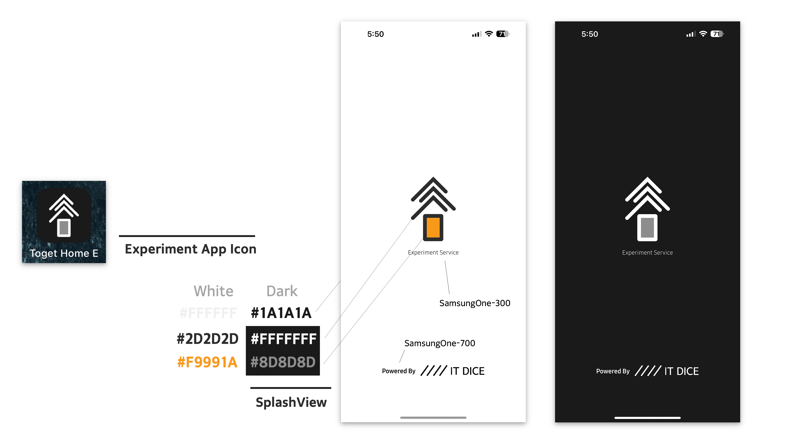
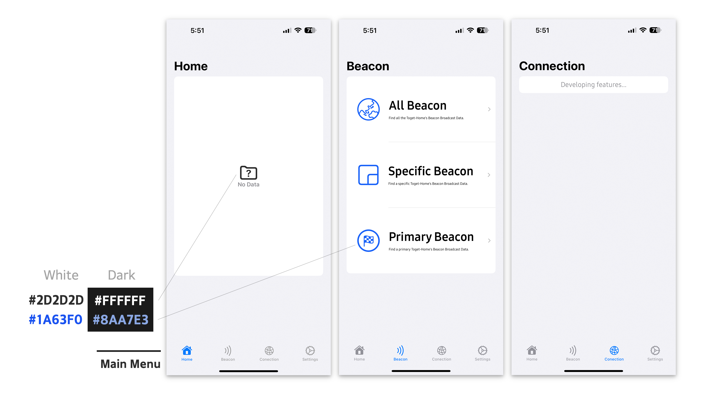
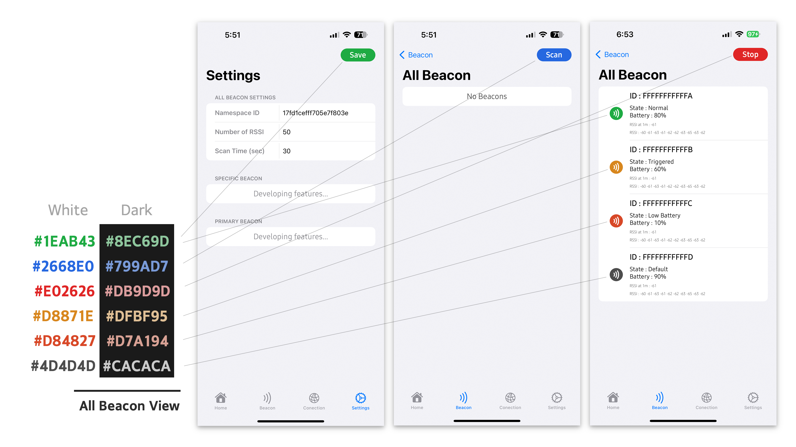

# Toget Home Experiment

### UI 1차 설계 (Toget Home E)

- “Toget Home” 로고에서 설정한 색상 가이드라인에 따라 White와 Dark Mode에서 모두 대응되도록 ColorSet을 설정하였다.
- 서로 다른 해상도를 가진 Device에 대응되어야 하므로 단일 이미지가 아닌 별도의 View를 구축하여 Universal 형태로 만들었다.
- 앱 구동 시 약 2초간 화면이 출력되고 이후 HomeView로 **Fade-out Effect**와 함께 넘어가게 된다.

- 각각 HomeView, BeaconView, ConnectionView, SettingsView로 연결되는 하단바를 만들어 이동이 가능하게 설계하였다. List가 짧을때는 배경색과 같은 색을 이용하여 구분 없이 표시되고 있지만, List가 길어 하단바를 넘어가는 경우 별도의 배경색을 표시하여 구분이 되도록 만들었다.
- View 상단에는 해당하는 View의 Title을 항시 나타내고 있다. 이 또한 List가 넘어가지 않은 경우에는 배경색과 같은색을 이용하여 구분 없이 표시되고, List가 넘어가는 경우에는 글자를 작게 만들고 별도의 배경색을 표시하여 구분한다.
- iOS SwiftUI 기본 배경색상 : **#f2f2f7**

- All Beacon View는 모든 Toget Home Beacon을 Scan하여 정보를 출력해주는 역할을 하고 있다. SettingView에서 설정한 NamespaceID, RSSI 저장 횟수, 최대 Scan Time을 지정해 Scan에 이용하고 있다.
- All Beacon View는 BeaconView에 소속되어 있는 View 이므로, 다른 View로 넘어갔다가 돌아오더라도 해당 View가 계속 표시되고 있어야 한다.
- “Save”, “Scan”, “Stop” 버튼은 항상 오른쪽 상단바 영역 안에 표시되고 있어야 한다.
- Beacon List에서는 InstanceID를 가장 크게 표시하며, State, Battery, RSSI at 1m, RSSI 순으로 표시한다. 시각적으로 State는 바로 알아보기 쉽도록 오른쪽 Beacon로고를 지정된 색상으로 표시한다.
